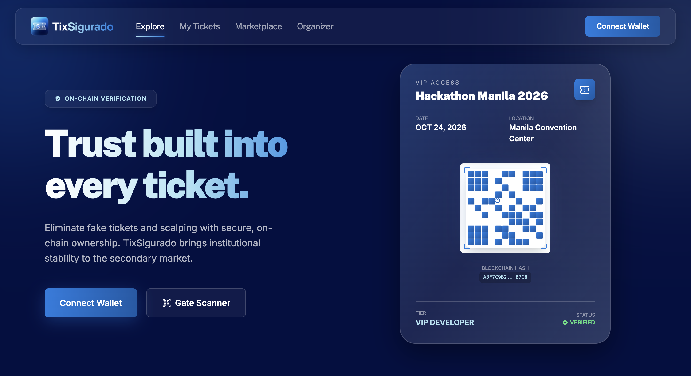
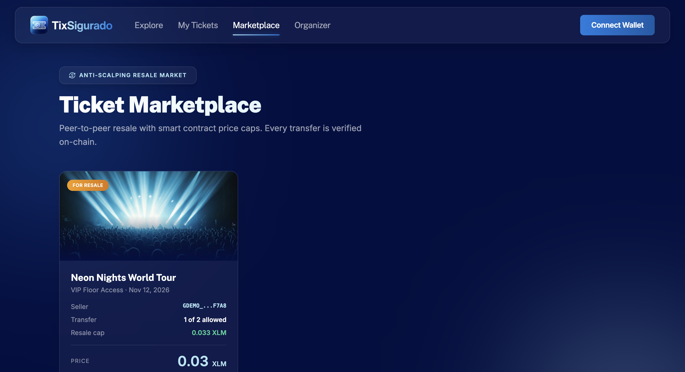
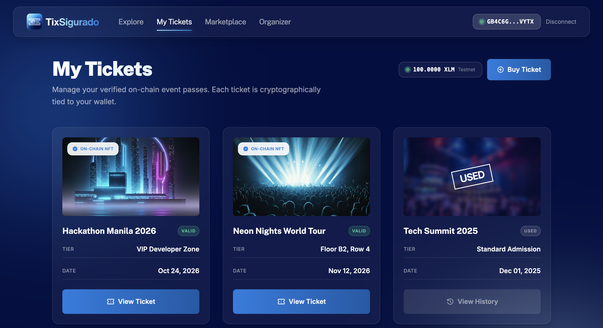
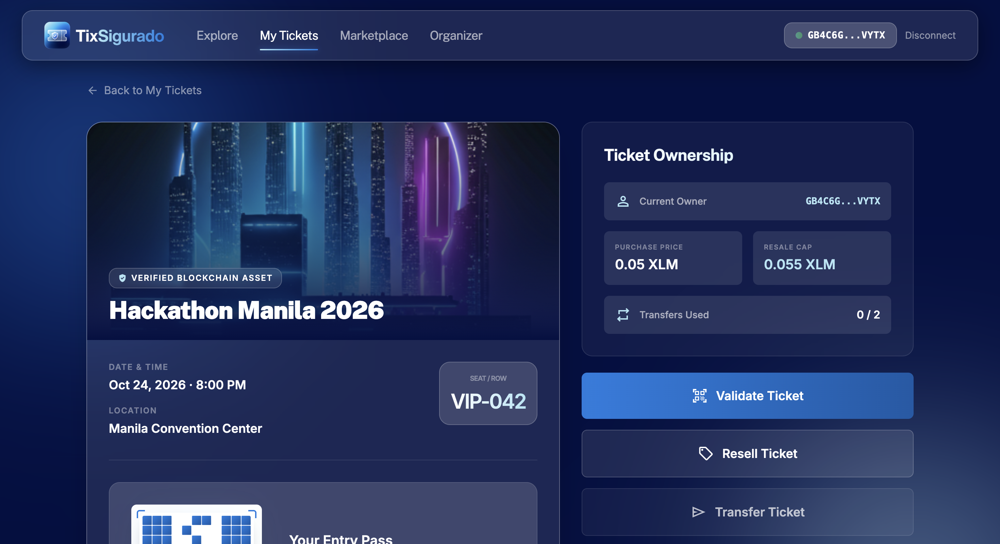
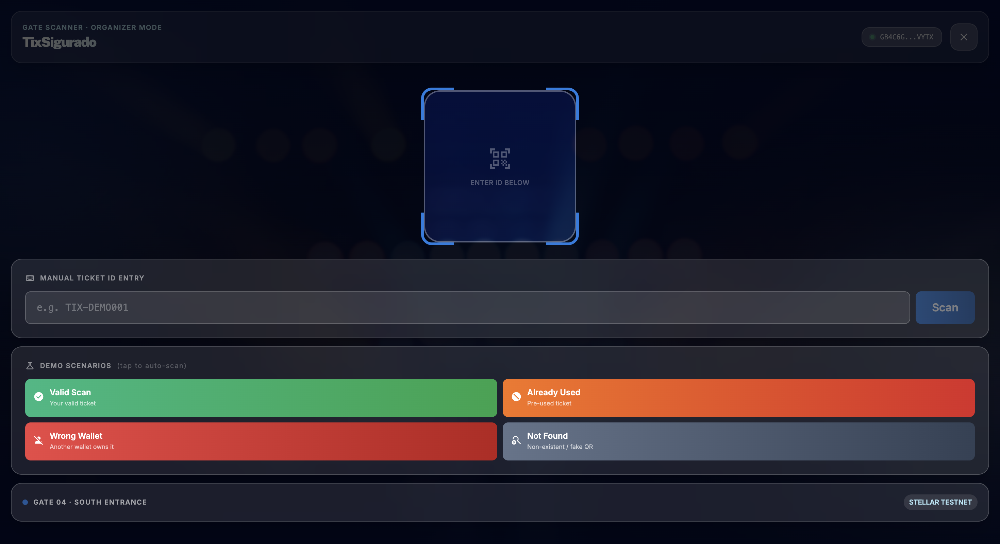
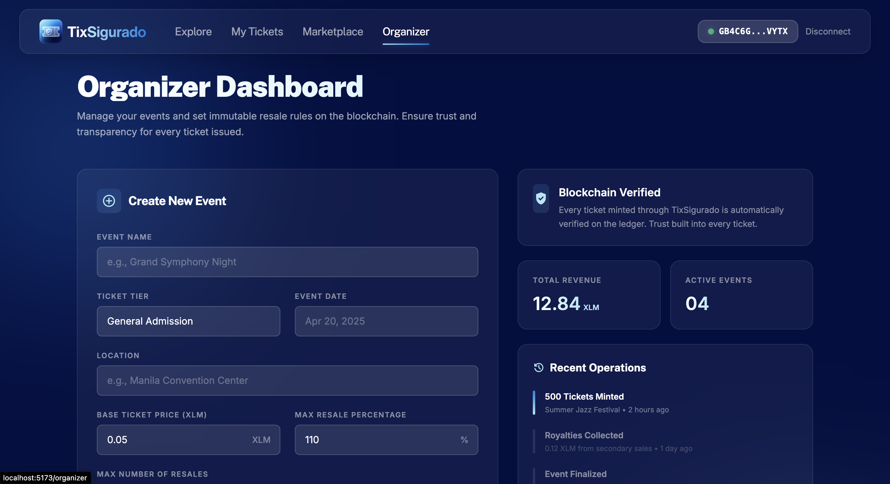

# TixSigurado

A blockchain-based event ticketing and resale marketplace built on the Stellar Soroban network. TixSigurado ensures secure, transparent, and fair ticket transactions — with on-chain anti-scalping price caps and QR-based gate verification.

---

## Overview

TixSigurado ("Tix" + "Sigurado" — Filipino for "certain/guaranteed") is a Web3 ticketing platform that gives event-goers, organizers, and gate staff a trustless way to handle tickets:

- **Buyers** purchase tickets directly connected to their Stellar wallet via Freighter.
- **Sellers** can resell tickets on the peer-to-peer marketplace with smart contract-enforced price caps to prevent scalping.
- **Organizers** manage events and monitor ticket issuance through a dedicated panel.
- **Gate staff** scan and validate QR-coded tickets in real time.

---

## Screenshots

**Landing Page**


**Marketplace**


**My Tickets Page**


**Ticket Details**


**Gate Scanner**


**Organizer Panel**


**Wallet Connect**


---

## Tech Stack

| Layer | Technology |
|---|---|
| Frontend | React 19, React Router 7 |
| Build Tool | Vite |
| Styling | Tailwind CSS |
| Blockchain | Stellar Soroban (smart contracts) |
| Wallet | Freighter, Soroban React SDK, Stellar SDK |
| Linting | ESLint |

---

## Features

- **Wallet Connect** — Seamless Freighter wallet integration for Stellar accounts
- **Ticket Collection** — View all owned tickets linked to your wallet
- **Anti-Scalping Marketplace** — Peer-to-peer resale with on-chain maximum price enforcement
- **QR Gate Scanner** — Real-time ticket validation for event entry
- **Organizer Panel** — Event creation and ticket issuance management
- **On-chain Verification** — Every ticket transaction is recorded on Stellar Soroban

---

## Pages & Routes

| Route | Description |
|---|---|
| `/` | Landing page |
| `/connect` | Wallet connection (Freighter) |
| `/tickets` | Your ticket collection |
| `/tickets/:id` | Individual ticket details |
| `/marketplace` | Resale marketplace |
| `/scan` | Gate scanner (QR verification) |
| `/organizer` | Event organizer panel |

---

## Getting Started

```bash
# Install dependencies
npm install

# Start development server
npm run dev

# Build for production
npm run build
```

> Make sure you have the [Freighter wallet extension](https://freighter.app) installed and connected to Stellar Testnet before using the app.

---

## Project Structure

```
src/
├── components/       # Shared UI components (Navbar, Footer, StatusBar, QRCode)
├── context/          # AppContext — global wallet and app state
├── pages/            # Route-level page components
└── main.jsx          # App entry point
```
