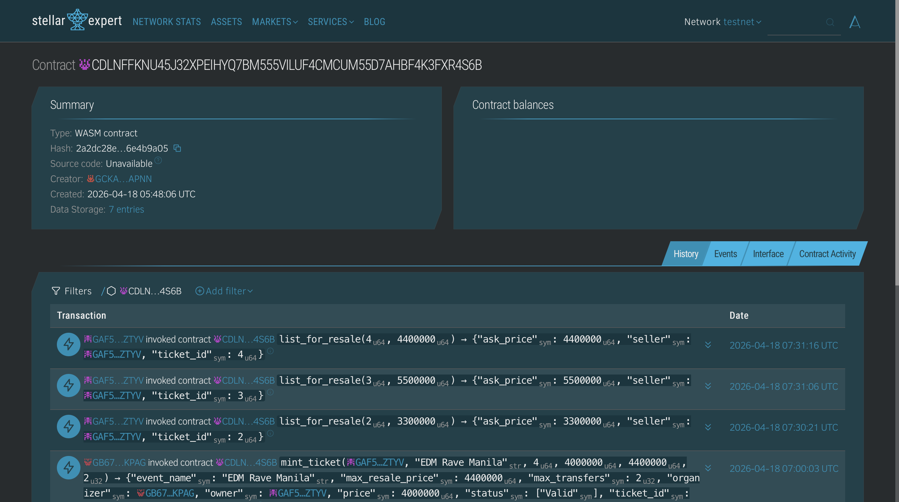

# TixSigurado

A blockchain-based event ticketing and resale marketplace built on the Stellar Soroban network. TixSigurado ensures secure, transparent, and fair ticket transactions — with on-chain anti-scalping price caps and QR-based gate verification.

---

## Overview

TixSigurado ("Tix" + "Sigurado" — Filipino for "certain/guaranteed") is a Web3 ticketing platform that gives event-goers, organizers, and gate staff a trustless way to handle tickets:

- **Buyers** purchase tickets directly connected to their Stellar wallet via Freighter.
- **Sellers** can resell tickets on the peer-to-peer marketplace with smart contract-enforced price caps to prevent scalping.
- **Organizers** manage events and monitor ticket issuance through a dedicated panel.
- **Gate staff** scan and validate QR-coded tickets in real time.

---

## Screenshots

**Contract Deployment**


**Landing Page**


**Marketplace**


**My Tickets Page**


**Ticket Details**


**Gate Scanner**


**Organizer Panel**


---

## Tech Stack

| Layer | Technology |
|---|---|
| Frontend | React 19, React Router 7 |
| Build Tool | Vite |
| Styling | Tailwind CSS |
| Blockchain | Stellar Soroban (smart contracts) |
| Wallet | Freighter, Soroban React SDK, Stellar SDK |
| Linting | ESLint |

---

## Features

- **Wallet Connect** — Seamless Freighter wallet integration for Stellar accounts
- **Ticket Collection** — View all owned tickets linked to your wallet
- **Anti-Scalping Marketplace** — Peer-to-peer resale with on-chain maximum price enforcement
- **QR Gate Scanner** — Real-time ticket validation for event entry
- **Organizer Panel** — Event creation and ticket issuance management
- **On-chain Verification** — Every ticket transaction is recorded on Stellar Soroban

---

## Pages & Routes

| Route | Description |
|---|---|
| `/` | Landing page |
| `/connect` | Wallet connection (Freighter) |
| `/tickets` | Your ticket collection |
| `/tickets/:id` | Individual ticket details |
| `/marketplace` | Resale marketplace |
| `/scan` | Gate scanner (QR verification) |
| `/organizer` | Event organizer panel |

---

## Getting Started

```bash
# Install dependencies
cd frontend
npm install

# Start development server
npm run dev

# Build for production
npm run build
```

> Make sure you have the [Freighter wallet extension](https://freighter.app) installed and connected to Stellar Testnet before using the app.

---

## Project Structure

```
frontend/
├── src/
│   ├── components/   # Shared UI components (Navbar, Footer, StatusBar, QRCode)
│   ├── context/      # AppContext — global wallet and app state
│   ├── pages/        # Route-level page components
│   └── main.jsx      # App entry point
├── public/           # Static assets
├── index.html
├── vite.config.js
├── tailwind.config.js
└── package.json
contract/
└── src/
    ├── lib.rs        # Soroban smart contract
    └── test.rs       # Contract tests
cargo.toml            # Rust / Soroban build config
```

---

## Smart Contract (Soroban)

The contract lives in `contract/src/lib.rs` and is built with [Soroban SDK 21.7.6](https://soroban.stellar.org).

### Contract functions

| Function | Auth | Description |
|---|---|---|
| `initialize(organizer)` | — | One-time setup |
| `mint_ticket(owner, event_name, ticket_id, price, max_resale_price, max_transfers)` | organizer | Creates a ticket NFT |
| `transfer_ticket(ticket_id, new_owner)` | owner | Transfers ownership |
| `list_for_resale(ticket_id, ask_price)` | owner | Lists on marketplace (price ≤ cap) |
| `buy_from_resale(ticket_id, buyer)` | buyer | Buys listed ticket; 5% royalty to organizer |
| `mark_ticket_used(ticket_id)` | organizer | Marks ticket used at gate |
| `validate_ticket(ticket_id, claimer)` | — | Returns "valid" / "used" / "listed" / "wrong_owner" |
| `cancel_listing(ticket_id)` | owner | Removes listing |

### Build & test

```bash
# Prerequisites
rustup target add wasm32-unknown-unknown
cargo install --locked soroban-cli

# Run tests
cargo test

# Build optimised WASM
cargo build --release --target wasm32-unknown-unknown
```

### Deploy to Testnet

```bash
soroban config network add testnet \
  --rpc-url https://soroban-testnet.stellar.org \
  --network-passphrase "Test SDF Network ; September 2015"

soroban keys generate deployer --network testnet
soroban keys fund deployer --network testnet

soroban contract deploy \
  --wasm target/wasm32-unknown-unknown/release/tixsigurado.wasm \
  --source deployer \
  --network testnet

soroban contract invoke --id <CONTRACT_ID> --source deployer --network testnet \
  -- initialize --organizer <ORGANIZER_ADDRESS>
```
